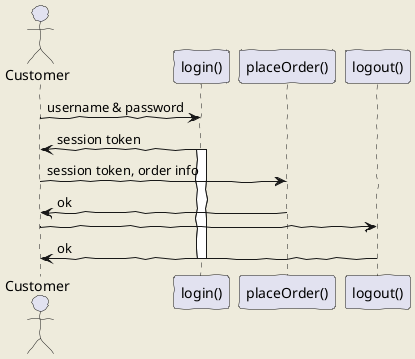

# 18강. 데이터 갱신하기 - UPDATE

> 테이블의 셀에 저장되어 있는 값을 갱신하려면 **UPDATE** 명령을 사용한다. 

```mysql
**UPDATE** 테이블명 **SET** 열1 = 값1, 열2 = 값2, ... **WHERE** 조건식;
```

no|a|b
--|-|-
1|ABC|2014-01-25
2|XYZ|NULL

sample41 테이블에 현재 위와 가튼 결과가 저장되어 있을 때, 아래와 같이 UPDATE문을 통해 값을 변경할 수 있다. <br>
```mysql
UPDATE sample41 SET b = '2014-09-07' WHERE no = 2;
```
no|a|b
--|-|-
1|ABC|2014-01-25
2|XYZ|**2014-09-07**

데이터 갱신 작업은 시스템을 다루는 과정에서 자주 발생한다. 데이터를 잘못 입력하여 수정해야 하는 경우 또한 빈번하다. 이때 실제 시스템에서 '등록'이나 
'갱신' 버튼을 클릭하면 데이터 갱신이 이루어진다고 이해하면 된다. 지금부터 이런 경우에 사용하는 UPDATE 명령에 관해서 설명한다. 

## 1. UPDATE로 데이터 갱신하기 
RDBMS에서는 UPDATE 명령으로 데이터를 갱신할 수 있다. UPDATE 명령은 테이블의 셀 값을 갱신하는 명령이다. 
```mysql
**UPDATE** 테이블명 **SET** 열명 = 값 **WHERE** 조건식 
```
UPDATE 명령을 실행하기 전에 기존 테이블에 어떤 데이터가 저장되어 있는지 SELECT 명령으로 확인해보자.
```mysql SELECT * FROM sample41;```
no|a|b
--|-|-
1|ABC|2014-01-25
2|XYZ|NULL

DELETE(행 단위 처리)와 달리 UPDATE는 셀 단위로 데이터를 갱신할 수 있다. WHERE 구를 생략한 경우에는 DELETE의 경우와 마찬가지로 테이블의 모든 행이 갱신된다. <br> <br>

UPDATE 명령에서는 **SET 구**를 사용하여 갱신할 열과 값을 지정한다. 문법은 'SET 열명 = 값'이다. 이때 '='은 비교 연산자가 아닌, 값을 대입하는 ```대입 연산자```이다. 
같은 '='이지만 연산 방법이 다르다는 점에 주의하자. 또한 테이블에 존재하지 않는 열을 지정하면 에러가 발생한다. <br> <br>

값은 상수로 표기한다. 앞에서 설명한 INSERT 명령과 마찬가지로 ```자료형에 맞는 값을 지정```해야 한다. 갱신해야 할 열과 값이 복수인 경우에는 '열 = 값'을 콤마(,)로 
구분하여 리스트 형식으로 지정할 수도 있다. SET 구에 지정한 갱신 내용은 처리 대상이 되는 모든 행에 적용된다. <br> <br>

UPDATE 명령의 WHERE 조건문 역시 DELETE 명령과 마찬가지로 조건에 일치하는 모든 행이 그 대상이 된다. 그리고 **WHERE** 구를 생략하면 테이블의 모든 행이 갱신 대상이 된다. 

## 2. UPDATE로 갱신할 경우 주의사항 
SET 구에서 '='은 대입 연산라자라는 점을 앞서 설명했다. UPDATE 명령은 이미 존재하는 행에 대해 값을 갱신하므로 이전의 값과 이후의 값의 두 가지 상태를 생각할 수 있다. 여기에서 다음과 같은 
UPDATE 명령을 실행하면 어떻게 될지 생각해보자. 
```mysql
UPDATE sample41 SET no = no + 1;
```
이 명령문에는 WHERE 구가 지정되어 있지 않으므로 갱신 대상은 테이블의 모든 행이 된다. SET 구에서는 no 열의 값을 갱신하는데, 갱신 후의 값은 본래값(갱신 전의 값)에서 1을 더한 결과이다. 
```mysql SELECT * FROM sample41; ```
no|a|b
--|-|-
1|ABC|2014-01-25
2|XYZ|2014-09-07
```mysql
UPDATE sample41 SET no = no + 1;

SELECT * FROM sample41;
```
no|a|b
--|-|-
2|ABC|2014-01-25
3|XYZ|2014-09-07

실행 결과, 모든 행의 no 값에 1씩 더해진 것을 알 수 있다. 이처럼 갱신할 값을 열이 포함된 식으로도 표기할 수 있다. 이때 해당 열이 갱신 대상이 되는 열이라 해도 상관없다. <br> <br>

## 3. 복수열 갱신 
UPDATE 명령의 SET 구에서는 필요에 따라 콤마(,)로 구분하여 갱신할 열을 여러 개 지정할 수 있다. 
명령문이 조금 길지만 어려운 부분은 없다. 다음과 같이 두 구문으로 나누어서 UPDATE 명령을 실행하는 것보다 하나로 묶어서 실행하는 편이 더 효율적이다. 
여기서 a 열을 갱신하는 UPDATE 명령과 b 열을 갱신하는 UPDATE 명령을 따로 실행하지 않고 a 열과 b 열을 같이 실행했다. 

```두 구문으로 나누어 UPDATE 명령 실행```

```mysql
UPDATE sample41 SET a = 'xxx' WHERE no = 2;
UPDATE sample41 SET b = '2014-' WHERE no = 2;
```
<br>

```하나로 묶어서 UPDATE 명령 실행```

```mysql
UPDATE sample41 SET a = 'xxx', b = '2014-01-01' WHERE no = 2;
```
### - SET 구의 실행 순서 
여러 개의 열을 한 번에 갱신할 수 있어 편리하기는 하지만, 그 전에 **SET** 구는 어떤 순서로 갱신 처리를 하는지 알아둘 필요가 있다. 


